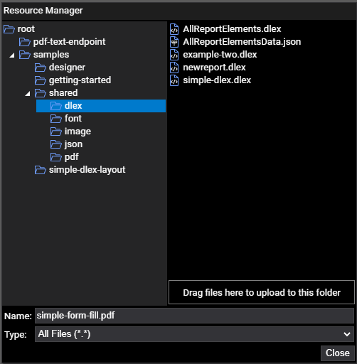

# java-client-examples

The project contains two main classes: `CloudApiExamples` and `InstructionsExamples`. The `CloudAPIExamples` provides examples for the `image-info`, `df-info, pdf-text`, `pdf-xmp`, and `pdf` endpoints. The `InstructionsExamples` class provides examples of using the `pdf` endpoint to illustrate merging, merge options, top-level meta-data, form fields, security, and (more here).

## Building

Both the `CloudApiExamples` and the `InstructionsExamples` are executable classes and expect the following runtime parameters. Also, when creating the path to the resources, be certain to create a sub-folder named `output`.

```java
args[0] := <api-key> args[1] := <base-path>
```

## Repository

The client library jar and client library source jar are available online. 

- https://repo1.maven.org/maven2/com/dynamicpdf/api/dynamicpdf-api/0.9.0/

Refer to sonatype's Maven repository search for incorporating the library into your application using Maven or one of the many other build tools.

- sonatype Maven Central Repository Search - https://search.maven.org/artifact/com.dynamicpdf.api/dynamicpdf-api/0.9.0/jar

### Maven

The examples project contains a Maven pom file for building the project. Be certain to build the java-api project before building this project.

> :memo: *Note that the dynamicpdf-api artifact is probably different than the version in the example pom, be certain to use the correct version when building the examples project.*

```xml
<project xmlns="http://maven.apache.org/POM/4.0.0"
	xmlns:xsi="http://www.w3.org/2001/XMLSchema-instance"
	xsi:schemaLocation="http://maven.apache.org/POM/4.0.0 https://maven.apache.org/xsd/maven-4.0.0.xsd">
	<modelVersion>4.0.0</modelVersion>
	<groupId>com.dynamicpdf.cloud.api.examples</groupId>
	<artifactId>dynamicpdf-api-examples</artifactId>
	<version>0.0.1-SNAPSHOT</version>
	<description>DynamicPDF Cloud API Java client library examples.</description>
	<properties>
		<maven.compiler.source>1.8</maven.compiler.source>
		<maven.compiler.target>1.8</maven.compiler.target>
	</properties>
	<dependencyManagement>
		<dependencies>
			<dependency>
				<groupId>com.dynamicpdf.api</groupId>
				<artifactId>dynamicpdf-api</artifactId>
				<version>0.0.1-SNAPSHOT</version>
			</dependency>
			<dependency>
				<groupId>commons-io</groupId>
				<artifactId>commons-io</artifactId>
				<version>2.8.0</version>
			</dependency>
		</dependencies>
	</dependencyManagement>
	<dependencies>
		<dependency>
			<groupId>com.dynamicpdf.api</groupId>
			<artifactId>dynamicpdf-api</artifactId>
			<version>0.9.0</version>
		</dependency>
		<dependency>
			<groupId>commons-io</groupId>
			<artifactId>commons-io</artifactId>
		</dependency>
	</dependencies>
</project>
```

## Resources

The needed local resources are contained in the `resources` folder in this project. The needed resources in the DynamicPdf Cloud API are contained in the `samples/shared` sub-folders.


